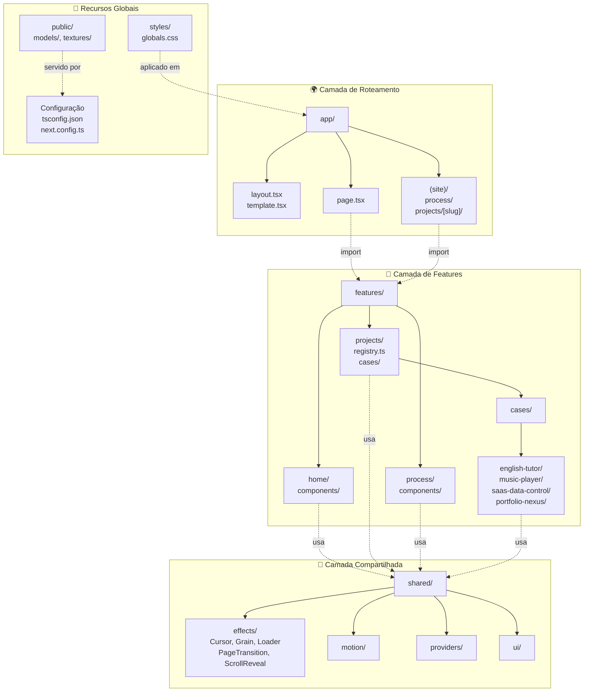
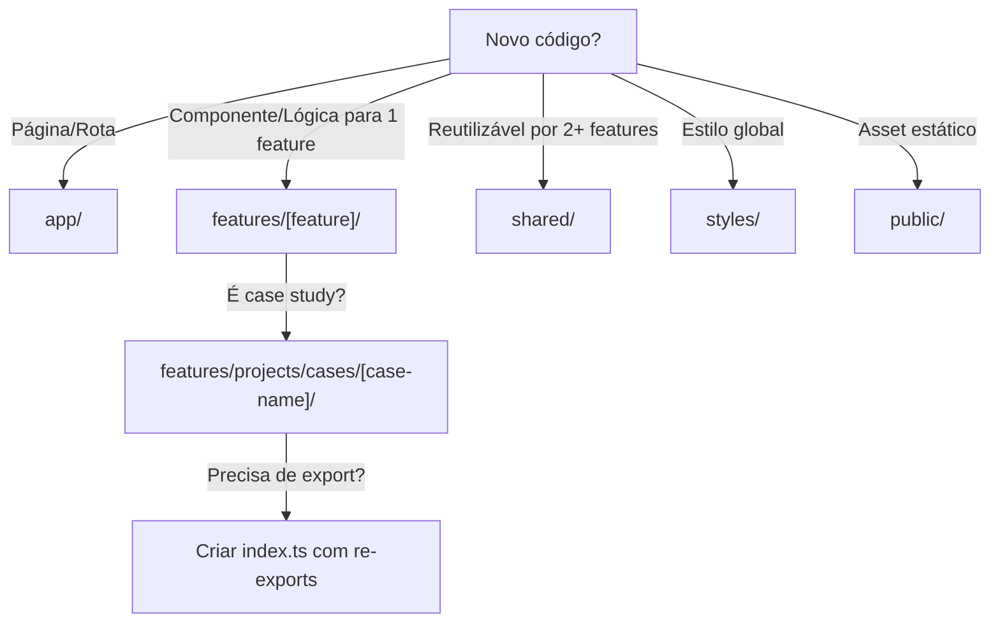

# 📊 Organização do Projeto Portfolio

## 🗺️ Mapa Visual da Estrutura



---

## 📚 O Que Cada Pasta Faz

### 🌍 **app/** - Roteamento (Camada Next.js)
```
Responsabilidade: Apenas roteamento e layout
├── layout.tsx          → Layout root da aplicação
├── template.tsx        → Template preservado entre trocas de página
├── page.tsx            → Home page
└── (site)/             → Grupo de rotas (sem slug na URL)
    ├── layout.tsx      → Layout das sub-rotas
    ├── page.tsx        → Home
    ├── process/        → Rota /process
    └── projects/[slug] → Rota dinâmica /projects/:slug
```

**Princípio**: Imports simplificados de features, sem lógica de negócio.

---

### 🎨 **features/** - Lógica de Domínio
```
Estrutura Feature-Driven: cada domínio isolado
│
├── home/               → Tudo sobre a página home
│   └── components/     → Hero, About, Contact, Stack, Terminal, HomePage
│
├── projects/           → Sistema completo de projetos
│   ├── registry.ts     → Registro central de todos os case studies
│   ├── components/     → ProjectCard, ProjectDetailPage, Projects, ThreeDMockup
│   ├── lib/            → Utilitários do domínio (project-format.ts)
│   └── cases/          → Casos de estudo isolados
│       ├── english-tutor/
│       │   ├── index.ts          → Entry point (re-export)
│       │   ├── data/             → brain.data, cta.data, engineering.data, etc
│       │   ├── components/       → Componentes específicos do case
│       │   ├── sections/         → Seções maiores (AdaptiveIntelligence, etc)
│       │   ├── hooks/            → Hooks customizados do case
│       │   ├── types/            → TypeScript types
│       │   ├── utils/            → Funções utilitárias
│       │   ├── config/           → colors.ts, depth.ts, glow.ts, motion.ts
│       │   ├── animations/       → Animações específicas
│       │   └── assets/           → Imagens e mídia do case
│       │
│       ├── music-player/         → Similar a english-tutor
│       ├── saas-data-control/    → Similar a english-tutor
│       └── portfolio-nexus/      → Similar a english-tutor
│
└── process/            → Página de processo/experiência
    └── components/     → ProcessExperience
```

**Princípio**: Colocação - tudo de um domínio junto, isolado de outros.

---

### 🔧 **shared/** - Primitivos Reutilizáveis
```
Código compartilhado entre múltiplas features
│
├── effects/            → Efeitos globais reutilizáveis
│   ├── Cursor.tsx      → Cursor customizado
│   ├── Grain.tsx       → Efeito grain
│   ├── Loader.tsx      → Loader
│   ├── PageTransition.tsx
│   ├── ScrollReveal.tsx
│   ├── SmoothScroll.tsx
│   └── magnetic/       → Efeito magnético
│
├── motion/             → Configurações de movimento
├── providers/          → Context providers globais
└── ui/                 → Componentes UI genéricos
```

**Princípio**: Apenas código usado por 2+ features. Caso contrário, fica na feature.

---

### 💎 **styles/** e **public/**
```
styles/                 → CSS global
public/                 → Assets estáticos (models 3D, texturas)
```

---

## 🛠️ Stack Tecnológico
| Camada | Tecnologia | Propósito |
|--------|-----------|----------|
| **Framework** | Next.js 16.2.6 | App Router, SSR, otimização |
| **UI** | React 19.2.4 | Componentes, estado |
| **3D** | Three.js + React Three Fiber | Gráficos 3D |
| **Animações** | Framer Motion + GSAP | Animações smooth |
| **Scroll** | Lenis | Smooth scroll |
| **Styling** | Tailwind CSS | Utility-first CSS |
| **Ícones** | Lucide React | Ícones SVG |
| **TypeScript** | TypeScript 5 | Type safety |

---

## ✅ O Que Está Bem Feito

1. ✅ **Separação de responsabilidades**: app/ vs features/ vs shared/
2. ✅ **Colocação de features**: cada domínio isolado (home, projects, process)
3. ✅ **Case studies bem estruturados**: english-tutor, music-player com config, data, components organizados
4. ✅ **Entry points claros**: index.ts em cada case
5. ✅ **Configuração centralizada**: registry.ts para projetos
6. ✅ **Assets organizados**: public/ separado, texturas/modelos 3D colocados

---

## 🚀 Melhorias Recomendadas (Passo a Passo)

### **PASSO 1: Criar Documentação de Componentes**
**Objetivo**: Documentar componentes com exemplos de uso

```
shared/ui/
├── Button/
│   ├── Button.tsx
│   ├── Button.stories.tsx    ← ADD
│   └── README.md              ← ADD
```

**Por quê**: Facilita reutilização e onboarding

---

### **PASSO 2: Criar um Sistema de Constantes Globais**
**Objetivo**: Centralizar valores mágicos (breakpoints, tempos de animação, cores)

```
shared/
├── constants/                 ← ADD
│   ├── breakpoints.ts
│   ├── animations.ts
│   ├── spacing.ts
│   └── colors.ts
```

**Benefício**: Consistência visual em todo projeto

---

### **PASSO 3: Criar Hooks Reutilizáveis**
**Objetivo**: Extrair lógica comum em hooks

```
shared/hooks/                  ← ADD
├── useScrollReveal.ts
├── useMousePosition.ts
├── useWindowSize.ts
└── use3DModel.ts
```

**Por quê**: DRY (Don't Repeat Yourself), testabilidade

---

### **PASSO 4: Adicionar Testes**
**Objetivo**: Garantir componentes críticos funcionam

```
shared/ui/Button/
├── Button.tsx
├── Button.test.tsx            ← ADD
└── Button.stories.tsx
```

**Ferramentas**: Jest + React Testing Library (já compatível com Next.js)

---

### **PASSO 5: Melhorar SEO com Metadados**
**Objetivo**: Cada página ter metadados dinâmicos

```typescript
// app/(site)/projects/[slug]/page.tsx
export async function generateMetadata({ params }) {
  const project = getProjectBySlug(params.slug);
  return {
    title: project.title,
    description: project.description,
    ogImage: project.ogImage,
  };
}
```

---

### **PASSO 6: Criar um Sistema de Temas**
**Objetivo**: Suportar modo claro/escuro facilmente

```
shared/themes/                 ← ADD
├── light.ts
├── dark.ts
├── ThemeProvider.tsx
└── useTheme.ts
```

---

### **PASSO 7: Adicionar Logging e Analytics**
**Objetivo**: Rastrear eventos e erros

```
shared/analytics/              ← ADD
├── tracker.ts
├── events.ts
└── logger.ts
```

---

### **PASSO 8: Criar Config para Variáveis de Ambiente**
**Objetivo**: Centralizar URLs, chaves de API

```
config/
├── env.ts                     ← ADD
└── constants.ts               ← ADD

// .env.local
NEXT_PUBLIC_API_URL=...
NEXT_PUBLIC_ANALYTICS_ID=...
```

---

### **PASSO 9: Otimizar Bundle Size**
**Objetivo**: Melhorar performance

**Ações**:
- [ ] Analisar bundle com `next/bundle-analyzer`
- [ ] Lazy load componentes 3D pesados
- [ ] Implementar código splitting automático
- [ ] Comprimir imagens em public/

---

### **PASSO 10: Adicionar Testes E2E**
**Objetivo**: Testar fluxos completos

```
e2e/                          ← ADD
├── projects.spec.ts
├── home.spec.ts
└── navigation.spec.ts
```

**Ferramenta**: Playwright ou Cypress

---

## 📊 Árvore de Decisão: Onde Colocar Novo Código?



---

## 🔄 Fluxo de Adição de Feature

```
1. Criar pasta em features/[nova-feature]/
   ├── components/
   ├── hooks/
   ├── utils/
   ├── data/
   ├── types/
   └── index.ts (re-exports principais)

2. Adicionar rota em app/(site)/[nova-feature]/page.tsx

3. Importar e usar:
   import { Component } from '@/features/[nova-feature]'

4. Se precisar de código compartilhado:
   → Mover para shared/
   → Criar index.ts em shared/[novo-modulo]/
```

---

## 📝 Checklist de Boas Práticas

- [ ] Cada arquivo tem responsabilidade única
- [ ] Componentes são pequenos e reutilizáveis
- [ ] Nomes são descritivos (não use `Component.tsx`)
- [ ] Tipos TS bem definidos (não use `any`)
- [ ] Dados estão em arquivos `.data.ts` separados
- [ ] Assets no public/ têm paths relativos
- [ ] Imports usam path aliases (`@/features`)
- [ ] Sem arquivos órfãos sem propósito claro

---

## 🎯 Próximos Passos Recomendados

**Imediato** (1-2 horas):
1. Executar PASSO 1 (Documentação)
2. Executar PASSO 2 (Constantes Globais)

**Curto prazo** (1-2 dias):
3. Executar PASSO 3 (Hooks Reutilizáveis)
4. Executar PASSO 5 (SEO)

**Médio prazo** (1 semana):
5. Executar PASSO 4 (Testes)
6. Executar PASSO 9 (Otimização)

**Longo prazo**:
7. Executar PASSO 6-8 (Temas, Analytics, Config)
8. Executar PASSO 10 (E2E Tests)

